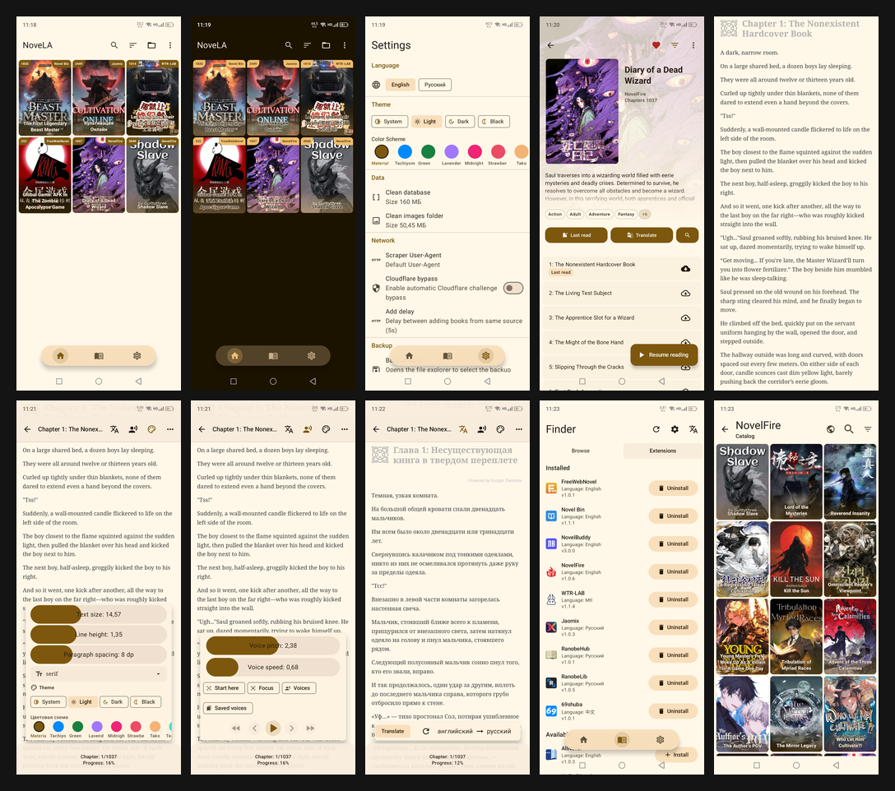

<!--
  android novel reader, web novel app, light novel reader android, epub reader android, ranobe reader, wuxiaworld, royal road, scribble hub, free novel reader, open source novel app
  андроид читалка ранобэ, читалка веб новелл андроид, ранобэ приложение, epub читалка андроид, бесплатная читалка новелл, jaomix, ranobelib
  安卓小说阅读器, 网络小说APP, 轻小说阅读器, 免费小说阅读, epub阅读器安卓, 开源小说应用
-->
<div align="center">


# NoveLA

Бесплатная читалка веб-новелл с открытым исходным кодом для Android.

[🇬🇧 English](README.md) · 🇷🇺 Русский

[](https://github.com/HnDK0/NoveLA/releases/latest)
[](https://github.com/HnDK0/NoveLA/releases)
[](LICENSE)
[](https://github.com/HnDK0/NoveLA/releases/latest)

<br/>

</div>

---

## Скачать

**[Получить последний APK](https://github.com/HnDK0/NoveLA/releases/latest)** — требуется Android 8.0+

Или собрать из исходников:

```bash
git clone https://github.com/HnDK0/NoveLA
# Откройте в Android Studio и запустите на устройстве или эмуляторе
```

---

## Возможности

- 25+ встроенных источников
- Глобальный поиск по нескольким источникам; добавление любой новеллы по URL
- Перевод прямо в читалке — без копирования и переключения приложений
- Бесконечная прокрутка глав с офлайн-кешированием
- Настраиваемые шрифты, размер текста, светлая/тёмная темы (Material 3)
- Озвучка текста с фоновым воспроизведением, управлением скоростью и тоном
- Локальная библиотека EPUB
- Резервное копирование и восстановление
- Очистка текста с помощью регулярных выражений (удаление рекламы и вставленного текста)
- Автоматический обход Cloudflare Turnstile
- Система плагинов на Lua от сообщества

---

## Перевод

Поддерживается четыре движка. При превышении лимита запросов API-ключи автоматически чередуются по кругу.

| Движок | Стоимость | API-ключ |
|---|---|---|
| Google Translate (Улучшенный) | Бесплатно | Не требуется |
| Google Translate (Простой) | Бесплатно | Не требуется |
| Google Gemini | Бесплатный уровень | Требуется |
| OpenAI-совместимый | Зависит от провайдера | Требуется |

OpenAI-совместимый режим поддерживает OpenAI, OpenRouter, DeepSeek, Ollama, Mistral и любые совместимые эндпоинты.

---

### Плагины

NoveLA поддерживает внешние плагины источников на Lua, устанавливаемые прямо из приложения.

Официальный репозиторий плагинов: [`HnDK0/external-sources`](https://github.com/HnDK0/external-sources)

Как добавить: **Поиск → Расширения → ⚙️ → вставьте URL репозитория**

---

## Участие в разработке

Pull request'ы приветствуются. Для крупных изменений сначала откройте issue.

- Исправление или улучшение существующих парсеров источников
- Добавление новых источников через [репозиторий плагинов](https://github.com/HnDK0/external-sources)
- Сообщения об ошибках через [Issues](https://github.com/HnDK0/NoveLA/issues)

---

## Технологии

Kotlin · Coroutines · Jetpack Compose · Material 3 · Room · Jsoup · OkHttp · Coil · LuaJ · Google MLKit · Android TTS & Media APIs

---

## Лицензия

[GPL-3.0](LICENSE)
